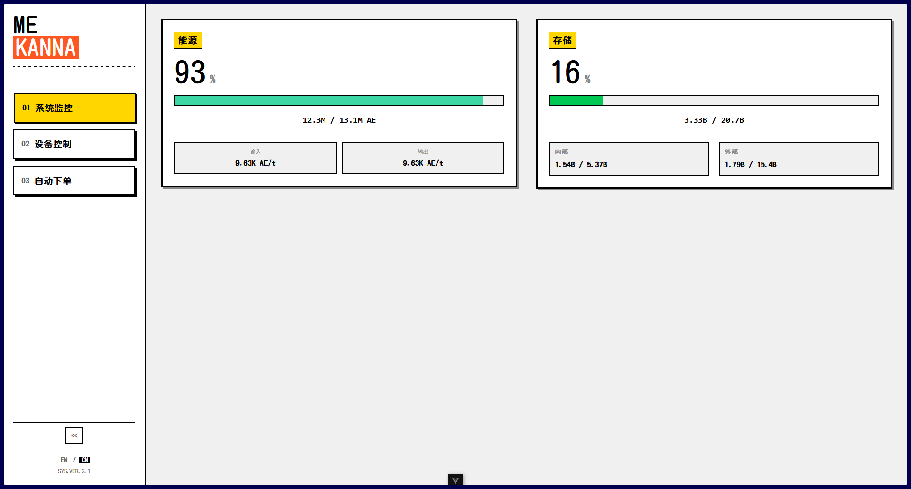
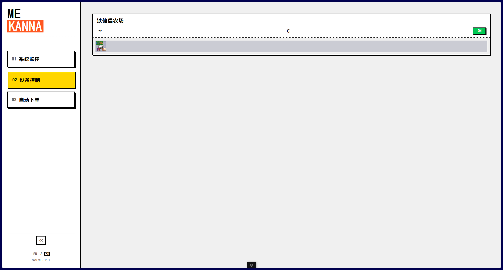
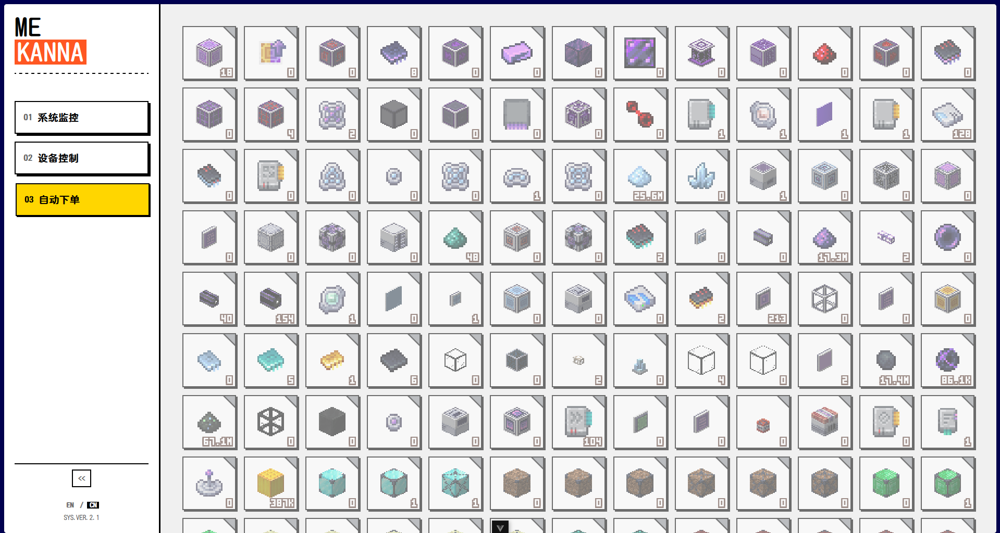

<div align="center">

# ME Kanna

**Minecraft AE2 网络实时监控 & 自动合成管理面板**

一个连接 AE2 与 Web 前端的全栈监控系

[功能特性](#-功能特性) •
[快速开始](#-快速开始) •
[架构](#-架构) •
[配置](#️-配置) •
[文档](#-文档)

</div>

---

## ✨ 功能特性

- **实时仪表盘** — 能源输入/输出/使用率、存储容量
- **工厂产能追踪** — 通过海龟记录每种物品的生产速率
- **库存监控** — 追踪可合成物品的 ME 网络库存
- **自动合成** — 设定最小/最大阈值，库存不足时自动下单合成
- **国际化** — 支持中文 / English，物品名称自动本地化
- **热更新脚本** — Lua 脚本自动 OTA 更新，首次安装后无需手动操作

## 📸 截图




## 📋 前置要求

- **Go** 1.25+
- **Node.js** 20.19+ / 22.12+
- **Minecraft Mods**
  - [Applied Energistics 2](https://www.curseforge.com/minecraft/mc-mods/applied-energistics-2)
  - [CC:Tweaked](https://www.curseforge.com/minecraft/mc-mods/cc-tweaked)
  - [Advanced Peripherals](https://www.curseforge.com/minecraft/mc-mods/advanced-peripherals)
  - [IconExporter](https://www.curseforge.com/minecraft/mc-mods/iconexporter) — 用于导出物品图标

## 🚀 快速开始

### 1. 准备图标资源

使用 IconExporter 模组导出整合包物品图标到 `.minecraft/icon-exports-x32` 目录。

### 2. 启动后端

在 `.minecraft` 所在目录下运行：

```bash
go run main.go
```

服务器监听 `0.0.0.0:8080`。

### 3. 启动前端

```bash
cd web
npm install
npm run dev
```

开发服务器默认地址：`http://localhost:5173`

### 4. 配置游戏内设备

只需**首次安装**时下载启动脚本，后续每次启动会自动更新。

**主计算机**（连接 ME Bridge 的那台）：

```lua
wget http://127.0.0.1:8080/lua/startup.lua startup/startup.lua
```

**生产监测海龟**：

```lua
wget http://127.0.0.1:8080/lua/startup_meter.lua startup/startup_meter.lua
```

下载完成后 `reboot` 重启即可。

## ⚙️ 配置
### Lua 端

编辑 `lua_scripts/lib/config.lua`：

```lua
M.HOST             = "http://127.0.0.1:8080"
M.WS_URL           = "ws://127.0.0.1:8080/ws/minecraft"
M.DEVICE_ID        = "ae_hub"    -- 设备ID
M.FACTORY_ID       = ""          -- 工厂的海龟ID（可选）
M.RECONNECT_DELAY  = 5           -- 重连延迟（秒）
M.SYNC_INTERVAL    = 60          -- 白名单同步周期（秒）
```

## 📁 项目结构

```
ME_Kanna/
├── main.go                  # 程序入口
├── internal/
│   ├── api/handlers.go      # HTTP & WebSocket 路由
│   ├── config/config.go     # 路径与全局配置
│   ├── model/types.go       # 数据结构定义
│   ├── service/             # 业务逻辑层
│   │   ├── autocraft.go     #   自动合成任务管理
│   │   ├── calculator.go    #   生产速率计算
│   │   ├── device.go        #   设备管理
│   │   ├── patterns.go      #   配方树构建
│   │   ├── whitelist.go     #   白名单持久化
│   │   ├── icon.go          #   物品图标解析
│   │   └── item_name.go     #   物品名称本地化
│   └── store/state.go       # 全局状态管理
├── lua_scripts/             # CC:Tweaked Lua 脚本
│   ├── main.lua             #   主计算机入口
│   ├── meter.lua            #   海龟计量入口
│   └── lib/                 #   共享库
├── web/                     # Vue 3 前端
│   └── src/
│       ├── components/      #   UI 组件
│       ├── composables/     #   组合式函数
│       ├── stores/          #   Pinia 状态管理
│       ├── api/             #   HTTP 请求封装
│       └── locales/         #   国际化文件
└── docs/                    # 开发文档
```

## 📖 文档

- [ME Bridge API 参考](docs/me_bridge_api.md)
- [前端集成指南](docs/frontend_integration_guide.md)
- [命名规范](docs/naming-conventions.md)

## 🤝 Contributing

欢迎提交 Issue 和 Pull Request！

1. Fork 本仓库
2. 创建特性分支 (`git checkout -b feature/amazing-feature`)
3. 提交更改 (`git commit -m 'feat: add amazing feature'`)
4. 推送分支 (`git push origin feature/amazing-feature`)
5. 发起 Pull Request
